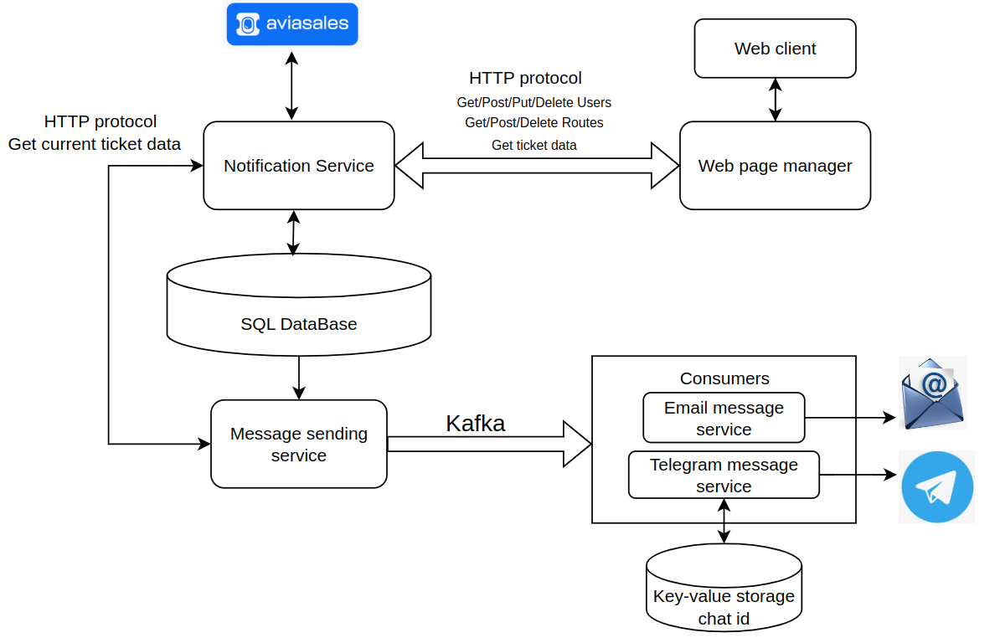
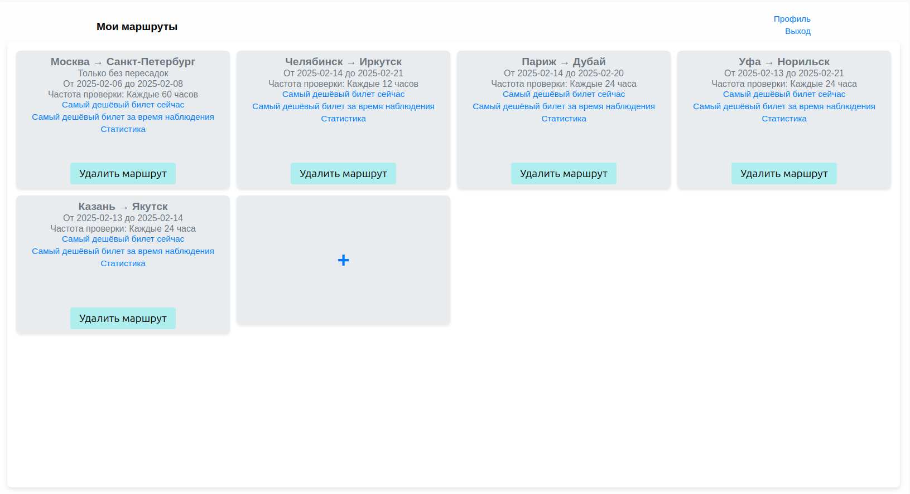

# Flight ticket tracking application

## Table of Contents
1. [Motivation](#motivation)
2. [Functionality](#functionality)
3. [Architecture](#architecture)
4. [Сomponents](#components)
5. [Deploy](#deploy)
6. [Tests](#tests)
7. [Appearence](#appearence)

## Motivation

I often fly on airplanes so that I know in advance about which dates I want to fly (for example, from January 27 to January 30). I don't care about the exact date of the trip, and I want to save money and fly cheaper. 

The prices of plane tickets depend on many factors: the current demand for tickets, the date of the trip, airline promotions, the phases of the moon, the constellations of Oreon and etc.  Therefore, the best option to buy a cheap ticket is to monitor prices in real time and buy when they drop! It is even more convenient to receive notifications about the current minimum ticket prices on set dates in your messenger.

Try application: <http://84.201.170.212:8082/> (If the application extends beyond the boundaries of your browser, try zooming out)
## Functionality

The service allows you to

* Set one or more routes for tracking on certain dates and get the current price in the web application;
* Receive notifications by mail and telegram on specified routes at selected time intervals;
* View price statistics for the specified routes in the web application;

## Architecture

## Сomponents

* **Notification_Service:** Microservice that implements the basic logic of the application:

    - User management (CRUD operations);  
    - Route management (CRUD operations);  
    - Integration with the Aviasales API to retrieve route information; 
    
    Writen on C++ Dragon framework. 
    
    In more details: <https://github.com/MikhailCherepanovD/notification_service_drogon>
    
* **Web_Page_Manager:**  Microservice for web pages managment and sending queries to Notification_Service, a layer between the web client and the main backend server.

    Writen on Python Flask framework. 

    In more details: <https://github.com/MikhailCherepanovD/notification_service_flask>

* **Sending_Message_Servise:**  Microservice in an endless loop checks the table allocated to it in the database for routes, information about which needs to be updated. If the routes for updating are found, the server sends a request to Notification_Service and after that send ticket info to Apache Kafka.

    Writen on C++ Dragon framework. 

    In more details: <https://github.com/MikhailCherepanovD/sending_messages_notification_service>

* **Email_Message_Service** and **Telegram_Message_Service:** Microservices that listen to Apache Kafka and send messages to email and Telegram. Telegram_Message_Service is connected to the Redis key-value storage for storing client chat IDs.  

    Written in Python Flask framework.  

    In more details: <https://github.com/MikhailCherepanovD/notification_email_sender>  

    And: <https://github.com/MikhailCherepanovD/notification_telegram_sender>  

* **DB:** PostgreSQL database. It contains 6 regular tables, a trigger, a table for the trigger, and a view. Some data processing functions are also written here.  

    In more details: <https://github.com/MikhailCherepanovD/notification_service_database>  

## Deploy  

Each microservice is packaged in a Docker container and managed via Docker Compose. The application is deployed and running on a Yandex Cloud VM.  

Link to deploy repository: <https://github.com/MikhailCherepanovD/notification_service_deploy>  

Link to my DockerHub: <https://hub.docker.com/u/cherepmd>  

### To run  

    git clone https://github.com/MikhailCherepanovD/notification_service_deploy  
    docker-compose up -d 
 ## Tests

Tests for Notification_Service was written in Postman.

Get tests in Json formate: <https://github.com/MikhailCherepanovD/notification_service_tests_postman>

 ##  Appearence

